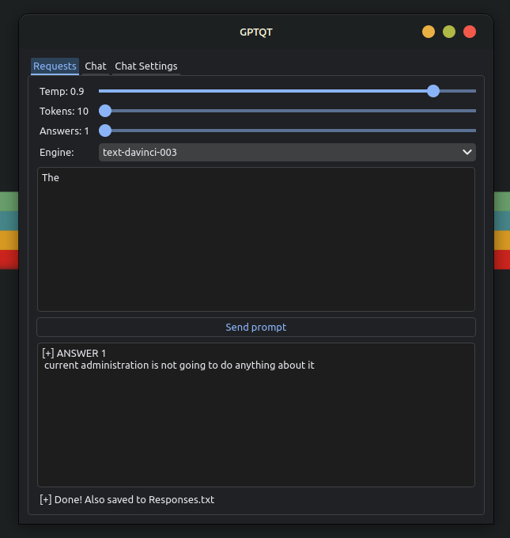

<h1 align="center">GPTQT</h1>

<p  align="center">


</p>

## About

GPTqt is a program that utilizes OpenAI's API to get completions/chat responses from their models, it's a work in progress and I will try to update it with features/fixes every once in a while. If you feel you can improve anything, open a PR.

Fined tuned models work best for applied applications.

## Installation

Python 3.10 is recommended, older versions will probably work just fine.

**You will need an OpenAI API key.**

```bash
git clone https://github.com/mokeWe/GPTqt
cd GPTqt 
pip install -r Requirements.txt
```

Before you run the program make sure your API key is in `api-key.txt`, it should start with `sk-...`.

The API key in api-key.txt is an **example key** and will **not** work.

Run the program:
```bash
python3 pyqt.py
```
  
## Basics

`Tokens` are the amount of characters to generate. 4 characters of tokenized English text is ~= to one token.

`Temperature`: how random the model will be in its generations. As the temperature approaches zero the model will become repetetive.

## Documentation

OpenAI provides a very good guide in prompt engineering and basic function for their large language models, it is called the [OpenAI Cookbook](https://github.com/openai/openai-cookbook). There are multiple examples within the repository that you can try out yourself.

## Screenshots
<details>
<summary>Click to expand.</summary>




</details>

## License

[GPLv3](LICENSE)
